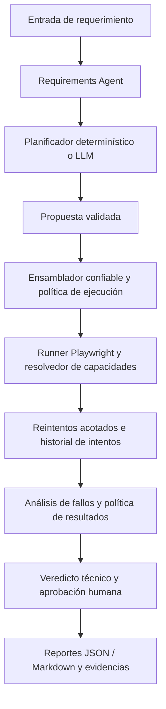

<div align="center">


<br /><br />

     

<br /><br />

<a href="README.md">Read in English</a>

</div>

# DRAGON QA Agentic Layer

> Quality Engineering basado en evidencias para el desarrollo moderno de software.

**La IA asiste a QA. La evidencia respalda las decisiones. Las personas conservan el control.**

<a id="contents"></a>
## Contenido

- [Descripción general](#overview)
- [Capacidades actuales y alcance](#capabilities)
- [Requisitos](#requirements)
- [Instalación](#installation)
- [Inicio rápido](#quick-start)
- [Cómo funciona y arquitectura](#architecture)
- [Referencia de configuración](#configuration)
- [Cómo adaptar DRAGON QA a cualquier proyecto](#project-adaptation)
- [Planificación LLM opcional](#providers)
- [Integración con Claude Code](#claude-code)
- [Autonomía, política de ejecución y gobernanza](#autonomy)
- [Verificaciones confiables soportadas](#trusted-checks)
- [Reintentos acotados y clasificación FLAKY](#retries)
- [Interpretación de resultados y veredictos](#verdicts)
- [Reportes y evidencias](#evidence)
- [Uso de la biblioteca JavaScript / TypeScript](#library)
- [Solución de problemas](#troubleshooting)
- [Controles de calidad y verificación de entrega](#quality)
- [Roadmap](#roadmap)
- [Contribuciones y pautas de extensión](#contributing)
- [Autor](#author)
- [Licencia](#license)

---

<a id="overview"></a>
## Descripción general

DRAGON QA Agentic Layer es un framework de Quality Engineering, orientado a CLI, que puede incorporarse a un proyecto de software existente sin reemplazar su aplicación ni su suite de pruebas. Convierte un requerimiento en un plan de pruebas estructurado, ejecuta únicamente verificaciones confiables y soportadas, conserva evidencias e historial de reintentos y produce un veredicto técnico explícito para revisión de QA.

El objetivo es aprovechar la IA en el ciclo de vida del software sin convertir al modelo en un ejecutor irrestricto. El planificador determinístico funciona sin LLM. Un cliente de planificación opcional, compatible con OpenAI, puede proponer escenarios, pero el núcleo controla identificadores, marcas de tiempo, modos de ejecución e intenciones confiables.

La versión actual es **v0.1.0-alpha**. Es una base funcional, no una plataforma de QA autónoma completa. No implementa automáticamente flujos de negocio arbitrarios, no descubre selectores, no modifica la aplicación y no reemplaza las decisiones humanas de aceptación. Está pensada para desarrollo local, entornos QA controlados y extensiones realizadas por equipos de ingeniería.

<a id="capabilities"></a>
## Capacidades actuales y alcance

La siguiente tabla distingue el comportamiento implementado de lo planificado. Que un escenario esté *planificado* no demuestra que haya sido *ejecutado*.

| Capacidad | Estado actual |
| --- | --- |
| Entrada de requerimientos | El texto recibido por CLI se normaliza y conserva; se rechaza una entrada vacía. |
| Planificación determinística | Genera escenarios de disponibilidad, camino feliz, camino negativo y casos límite. Por defecto, sólo disponibilidad tiene una capacidad de ejecución confiable. |
| Planificación con LLM | Cliente opcional compatible con OpenAI, validación estricta de JSON/esquema y máximo de 50 escenarios propuestos. La salida del modelo no autoriza la ejecución. |
| Verificaciones confiables | Están implementadas `application-availability`, `http-status`, `page-title` y `page-text`. |
| Ejecución en navegador | Playwright con Chromium, Firefox o WebKit seleccionados por configuración. Pasaron pruebas smoke reales con Chromium; esto no equivale a una certificación completa entre navegadores. |
| Evidencias | Capturas, trazas y video configurables; reportes JSON y Markdown. |
| Inteligencia de fallos | Señales estructuradas, clasificación determinística, agregación de veredictos técnicos y bandera separada de aprobación humana. |
| Reintentos | Reintentos acotados y opt-in para fallos de red/timeout, historial por intento, rutas de evidencia aisladas y clasificación conservadora FLAKY. |
| Configuración por proyecto | YAML, override de URL por CLI, selección de planificador determinístico/LLM y entrada pública TypeScript/JavaScript. |
| Uso desde Claude Code | Flujo CLI externo validado localmente con Playwright y lectura de reportes; no implica un adaptador nativo de Anthropic. |
| Todavía no implementado | Agentes generales de acciones de navegador, self-healing de selectores, automatización de flujos de negocio específicos, testing general de API/contratos/accesibilidad/visual, dashboard e integraciones Jira/GitHub/MCP listas para usar. |

El esquema ya contiene flags para API, accesibilidad y testing visual. Esos flags **no** significan que existan los runners generales correspondientes. Del mismo modo, un modelo puede proponer esos tipos de escenarios, pero los no soportados quedan para revisión manual. Los directorios de adaptadores y del runner API describen explícitamente trabajo futuro.

<a id="requirements"></a>
## Requisitos

Se necesita Node.js **20 o superior**, npm y un navegador soportado por Playwright. El paquete declara `node >=20` y la versión actual es `0.1.0-alpha`. El smoke local de consumo verificado utilizó Windows y Node.js 24; los demás entornos soportados deben comprobarse en el pipeline correspondiente.

Para el navegador predeterminado:

```bash
npx playwright install chromium
```

Instalá Firefox o WebKit con el mismo comando de Playwright si los seleccionás en el YAML. En Linux o CI pueden requerirse dependencias adicionales del sistema operativo; consultá la guía oficial de instalación de Playwright. **No se necesita un servicio LLM** para la planificación determinística.

<a id="installation"></a>
## Instalación

### Opción A — Desde el repositorio (recomendada para esta alpha)

Cloná el repositorio, instalá las dependencias fijadas en el lockfile, compilá y ejecutá las pruebas:

```bash
git clone https://github.com/GFGaldeano/dragon-qa-agentic-layer.git
cd dragon-qa-agentic-layer
npm ci
npx playwright install chromium
npm run typecheck
npm test
npm run build
```

El CLI del repositorio se invoca mediante `npm run dragon -- ...`. También existen `npm run dev`, `npm run qa:init` y `npm run qa:run` para trabajar desde el código fuente.

### Opción B — Instalar un tarball local en otro proyecto

Este es el flujo de consumo del paquete que fue verificado. Desde el repositorio DRAGON QA, ejecutá:

```bash
npm pack
```

El comando ejecuta `prepack` (`clean` seguido de `build`) y crea `dragon-qa-agentic-layer-0.1.0-alpha.tgz`. En la raíz del proyecto destino, instalá ese tarball con su ruta real:

```bash
npm install --save-dev /path/to/dragon-qa-agentic-layer-0.1.0-alpha.tgz
npx playwright install chromium
npx dragon-qa --version
npx dragon-qa init
```

En Windows, utilizá la unidad/ruta real del tarball. También podés ejecutar el CLI instalado mediante `npm exec -- dragon-qa ...` o `node_modules/.bin/dragon-qa` (el shim `.cmd` en Windows).

**Estado de distribución:** la evidencia actual verifica un tarball compilado localmente e instalado externamente. Este README no afirma que el paquete esté publicado en el registro npm. No supongas que `npm install dragon-qa-agentic-layer` resolverá una versión publicada hasta confirmar explícitamente una publicación.

Si trabajás desde el código fuente, usá `npm run dragon -- init` en lugar del comando del paquete instalado.

<a id="quick-start"></a>
## Inicio rápido

Ejecutá estos comandos **en el proyecto que querés probar**. Iniciá por separado el servidor de desarrollo o QA de esa aplicación.

```bash
# Paquete instalado:
npx dragon-qa init

# Alternativa desde el código fuente:
# npm run dragon -- init
```

`init` crea `dragon-qa.config.yaml` si todavía no existe y crea `.dragon-qa/runs`. Copia la configuración de ejemplo incluida cuando está disponible y no sobrescribe una configuración existente. Editá el YAML generado antes de ejecutar.

Para una aplicación local:

```bash
npx dragon-qa run --url http://localhost:3000 --requirement "The application must be reachable"
```

Desde el código fuente:

```bash
npm run dragon -- run --url http://localhost:3000 --requirement "The application must be reachable"
```

`--url` reemplaza `project.baseUrl` durante esa invocación. `--requirement` es obligatorio. En esta versión no existen switches CLI implementados `--config`, `--provider` ni `--autonomy`; editá el YAML para cambiar esos valores.

### Qué debería demostrar una primera ejecución

Con el planificador determinístico se generan cuatro escenarios. El escenario confiable de disponibilidad puede ejecutarse en `assist`; los tres escenarios genéricos de negocio quedan en `REVIEW`. Por eso, un resultado típico mezcla una verificación de disponibilidad con escenarios pendientes de revisión, en vez de afirmar que todo el requerimiento pasó.

Un smoke local también puede devolver legítimamente `REVIEW` para disponibilidad si utiliza una URL `data:` u otro destino que no satisface la verificación real del navegador. Revisá los mensajes y las evidencias, en lugar de interpretar el código de salida del proceso como un veredicto QA.

<a id="architecture"></a>
## Cómo funciona y arquitectura

La implementación actual sigue un pipeline acotado:



Las responsabilidades están separadas deliberadamente:

| Componente | Responsabilidad |
| --- | --- |
| Requirements Agent | Recorta y valida el texto del requerimiento; lo conserva como dato de entrada. |
| Proveedores de planificación | Planificación determinística o propuesta opcional generada por un modelo. El contrato LLM estricto sólo contiene descripciones, tipos, prioridades y resultados esperados. |
| Ensamblador del plan | Asigna IDs y timestamps confiables, valida el plan final y construye las intenciones mediante la política confiable. |
| Política de ejecución | Permite únicamente capacidades conocidas con parámetros confiables válidos. Las propuestas incompletas o no soportadas pasan a `manual-review`. |
| Runner y ejecutores | Despacha una intención soportada a un ejecutor Playwright dedicado. La ausencia de intención o ejecutor no dispara una acción inventada. |
| Capa de reintentos | Decide si un fallo confirmado permite otro intento; registra resultados y decisiones. |
| Capa de resultados/veredictos | Resuelve FLAKY de forma conservadora, agrega veredictos técnicos y calcula por separado la necesidad de aprobación. |
| Reporter | Escribe JSON estructurado y Markdown legible, incluido el historial de reintentos. |

### Límite de confianza

El esquema validado de salida del LLM no contiene IDs de escenario, timestamps, modos de ejecución, capacidades ni especificaciones de ejecución. Esos campos los asigna código confiable. Por lo tanto, la ruta LLM actual genera planes para revisión; no se concede acciones de navegador ni selectores arbitrarios. Una capacidad interna soportada debe ser suministrada explícitamente por una ruta confiable para poder ejecutarse.

Este límite arquitectónico no equivale a un sandbox de seguridad completo. La biblioteca acepta una URL base proporcionada por el llamador y la aplicación probada puede tener efectos secundarios. Limitá los destinos a entornos que tengas autorización para probar y utilizá cuentas/datos aislados cuando corresponda.

<a id="configuration"></a>
## Referencia de configuración

El archivo predeterminado es `dragon-qa.config.yaml`, resuelto desde el directorio de trabajo actual. El loader interpreta YAML y lo valida con Zod. Partí del ejemplo generado y cambiá únicamente lo necesario.

```yaml
project:
  name: example-project
  baseUrl: http://localhost:3000

autonomy:
  level: assist

testing:
  ui: true
  api: false
  accessibility: false
  visual: false

browser:
  engine: chromium
  headless: true
  timeoutMs: 30000

evidence:
  screenshots: true
  trace: true
  video: false

reporting:
  markdown: true
  json: true

providers:
  planner: deterministic
  failureAnalyzer: deterministic
```

### Campos de configuración

| Campo | Significado / valor predeterminado |
| --- | --- |
| `project.name` | Identificador descriptivo obligatorio y no vacío. |
| `project.baseUrl` | URL obligatoria utilizada como destino de navegación confiable. El override CLI `--url` se aplica después de cargar el YAML. |
| `autonomy.level` | `observe`, `assist`, `execute` o `autonomous`; predeterminado `assist`. |
| `testing.ui` | Booleano, predeterminado `true`. Los flags no implican que existan runners generales API/accesibilidad/visual. |
| `testing.api` / `accessibility` / `visual` | Booleanos, predeterminados `false`; reservados para soporte más amplio. |
| `browser.engine` | `chromium`, `firefox` o `webkit`; predeterminado `chromium`. |
| `browser.headless` | Booleano, predeterminado `true`. |
| `browser.timeoutMs` | Número positivo; predeterminado `30000`. |
| `evidence.screenshots` / `trace` | Booleanos; ambos predeterminados `true`. |
| `evidence.video` | Booleano; predeterminado `false`. |
| `reporting.markdown` / `json` | Booleanos; ambos predeterminados `true`. |
| `providers.planner` | `deterministic` (predeterminado) o `llm` mediante el resolvedor disponible. |
| `providers.failureAnalyzer` | Conservá `deterministic`; el orquestador actual construye el analizador incorporado. |
| `providers.plannerModel` | Configuración opcional del modelo, obligatoria cuando el planificador es `llm`. |
| `retry` | Política opcional de reintentos acotados; ausente o desactivada significa sin reintentos. |

El esquema acepta una cadena URL para `baseUrl`; no constituye una allowlist completa de URLs ni una protección SSRF. No pases destinos no confiables a un entorno de ejecución privilegiado. Mantené la configuración de cada proyecto fuera del código fuente de DRAGON QA y nunca commitees credenciales reales.

<a id="project-adaptation"></a>
## Cómo adaptar DRAGON QA a cualquier proyecto

La parte independiente del proyecto es el pipeline de QA. Adaptarlo significa proporcionar la aplicación destino, sus requerimientos y verificaciones confiables apropiadas, no copiar supuestos de negocio dentro del núcleo.

### Ejemplo: una aplicación web independiente

Supongamos que tu aplicación se llama `customer-portal` y corre en `http://localhost:4200`. En la raíz de esa aplicación:

1. Instalá DRAGON QA desde el tarball local o utilizá el código fuente.
2. Instalá el navegador Playwright requerido y ejecutá `init`.
3. Configurá `project.name` como `customer-portal` y `project.baseUrl` como `http://localhost:4200`.
4. Para la primera ejecución, conservá `autonomy.level: assist`, `providers.planner: deterministic` y los reintentos desactivados.
5. Iniciá la aplicación y ejecutá un requerimiento específico.
6. Abrí el reporte; revisá los escenarios de negocio y la información de aceptación faltante.
7. Incorporá capacidades confiables específicas mediante las interfaces de extensión si necesitás más automatización.

Por ejemplo:

```bash
npx dragon-qa run --requirement "The customer portal must be reachable"
```

Un requerimiento como “Un cliente puede actualizar su dirección” sirve para planificar, pero esta alpha no conoce los campos, autenticación, reglas de validación ni flujo de actualización de esa aplicación. Esos escenarios quedan para revisión manual salvo que tu integración proporcione comportamiento de ejecución confiable y soportado. No conviertas un requerimiento vago en un PASS automatizado inventado.

### Extender la capa de ejecución

La biblioteca pública exporta `ScenarioExecutor`, `ScenarioExecutorResolver`, `PlaywrightRunner` y contratos relacionados. Un ejecutor personalizado recibe un `TestScenario` y un contexto con `runDirectory` y `baseUrl`, y devuelve un `TestExecutionResult`. El runner acepta un resolvedor opcional.

Una extensión segura debería definir una intención acotada, validar sus parámetros, registrar un ejecutor dedicado y hacer que una ruta de planificación confiable autorice esa intención. La unión actual de intenciones y la política son deliberadamente cerradas; agregar una capacidad **nueva** requiere cambios de código y contratos, además de tests. No alcanza con agregar una clave YAML, devolver un campo nuevo en el JSON del LLM o registrar un ejecutor.

El orquestador actual construye internamente su runner predeterminado. No expone un mecanismo completo de carga de plugins para ejecutores arbitrarios. Una aplicación que incorpore la biblioteca puede componer el runner y el resolvedor exportados; una capacidad nueva totalmente integrada necesita su correspondiente integración de política/contrato confiable. Mantené los adaptadores empresariales fuera del núcleo reutilizable.

### Antes de declarar listo un proyecto

Verificá el entorno destino real, criterios de aceptación, credenciales y permisos, aislamiento de datos, resultados esperados y revisión humana requerida. DRAGON QA complementa las pruebas unitarias, de integración, E2E y manuales existentes; no las reemplaza.

<a id="providers"></a>
## Planificación LLM opcional

El planificador determinístico es el predeterminado y no necesita credenciales de modelos. Para utilizar el planificador LLM implementado, configurá un servicio que exponga un endpoint compatible con chat completions.

```yaml
providers:
  planner: llm
  failureAnalyzer: deterministic
  plannerModel:
    type: openai-compatible
    baseUrl: http://localhost:11434/v1
    model: your-installed-model
    # Opcional para endpoints con autenticación:
    # apiKeyEnv: DRAGON_QA_API_KEY
```

Reemplazá el endpoint y el modelo por los valores reales de tu proveedor. El cliente agrega `/chat/completions` a `baseUrl`, envía un `POST` con el modelo y el prompt seleccionados y espera una respuesta que contenga `choices[0].message.content`.

Si configurás `apiKeyEnv`, la variable de entorno indicada debe tener un valor no vacío. Por ejemplo, definí `DRAGON_QA_API_KEY` en tu shell o gestor de secretos antes de ejecutar; no coloques la credencial en el YAML. Cuando esa opción está ausente, no se envía una API key.

El modelo debe devolver JSON válido conforme al esquema estricto de planificación. El contrato implementado admite 1–50 escenarios con `title`, `description`, `kind`, `priority` y `expectedResult`. No acepta autoridad de ejecución seleccionada por el modelo. JSON inválido, errores de esquema, configuración de modelo faltante, credenciales configuradas ausentes y proveedores no soportados producen errores en lugar de inventar silenciosamente un plan.

**Compatibilidad no significa soporte universal de proveedores.** Es necesario probar el endpoint compatible y su modelo. Los adaptadores nativos Anthropic/Claude, la integración de planificación MCP y otros proveedores siguen siendo trabajo futuro. `.env.example` enumera posibles credenciales de integración, pero el CLI actual no lo carga automáticamente y su existencia no demuestra que esas integraciones estén implementadas.

<a id="claude-code"></a>
## Integración con Claude Code

DRAGON QA puede utilizarse desde Claude Code como herramienta CLI externa. Claude Code puede ejecutar la aplicación, consultar sus reportes JSON/Markdown y asistir a QA en la interpretación de resultados. Para este flujo no es necesario configurar Claude Code como proveedor LLM interno de DRAGON.

Se completó un smoke local de integración con Claude Code 2.1.72, Node.js 24.15.0, DRAGON QA 0.1.0-alpha y Playwright Chromium. La prueba utilizó una aplicación HTTP temporal, planificación determinística, autonomía `assist` y reintentos desactivados.

La ejecución generó cuatro escenarios: S001 se ejecutó y pasó; S002–S004 permanecieron para revisión manual. El veredicto final fue `REVIEW`, con `humanApprovalRequired: true`. Se verificaron las evidencias de captura, traza y reportes JSON y Markdown.

Esto valida el flujo básico **Claude Code → CLI de DRAGON QA → Playwright → reportes → revisión de QA**. No demuestra integración nativa con la API de Anthropic, autonomía irrestricta de navegador ni preparación para todos los entornos empresariales.

El cliente de planificación compatible con OpenAI continúa disponible por separado. Requiere un endpoint de chat completions compatible y un modelo que cumpla el contrato estricto de planificación de DRAGON. La compatibilidad con cada proveedor/modelo debe verificarse; este smoke de Claude Code no probó la API oficial de OpenAI.

<a id="autonomy"></a>
## Autonomía, política de ejecución y gobernanza

Los cuatro valores de configuración están implementados, pero sus nombres deben interpretarse según la política real:

| Nivel | Comportamiento actual |
| --- | --- |
| `observe` | Todos los escenarios se asignan a `manual-review`; la política no autoriza ejecución de escenarios. |
| `assist` | Pueden ejecutarse capacidades confiables soportadas. Los escenarios no soportados quedan para revisión y la ejecución requiere aprobación humana. |
| `execute` | Utiliza el mismo límite de capacidades soportadas; las ejecuciones no autónomas siguen requiriendo aprobación humana. |
| `autonomous` | Nivel opt-in con las mismas capacidades acotadas. No permite acciones arbitrarias del modelo. La aprobación se determina según resultados reales y la política de reintentos. |

La implementación actual de `execute` no incluye una base persistente de aprobaciones ni un flujo que compruebe un plan previamente aprobado. El nivel `autonomous` existe en código, pero no es un agente general de navegación autónoma.

El veredicto técnico y `humanApprovalRequired` son independientes. En modo autónomo, los resultados ordinarios que no requieren revisión pueden no solicitar aprobación adicional, pero los resultados vacíos/en revisión sí, y una recuperación flaky confirmada requiere aprobación. El CLI informa esta necesidad; no ofrece una interfaz completa de aprobación, firma de auditoría ni un sistema de autorización de release gates.

Usá el modo predeterminado `assist` para la adopción inicial. No confundas la ausencia de una solicitud de aprobación con aceptación de negocio o permiso para desplegar.

<a id="trusted-checks"></a>
## Verificaciones confiables soportadas

Las intenciones de ejecución incorporadas son deliberadamente pequeñas:

| Intención | Qué verifica |
| --- | --- |
| `application-availability` | Navega a la URL base configurada y verifica que la navegación del navegador termine. No es una comprobación completa de salud de negocio ni una aserción de estado HTTP. |
| `http-status` | Navega a la URL configurada y compara el estado HTTP real con un `expectedStatus` confiable, entero entre 100 y 599. |
| `page-title` | Navega a la URL configurada y compara el título exactamente, distinguiendo mayúsculas/minúsculas, con `expectedTitle` confiable. |
| `page-text` | Lee `body.innerText()` y comprueba que contenga `expectedText` confiable, distinguiendo mayúsculas/minúsculas. |

Las últimas tres verificaciones necesitan sus especificaciones de ejecución confiables correspondientes. Su presencia en el contrato interno no crea un switch CLI para aserciones arbitrarias. El plan determinístico del CLI suministra actualmente sólo la capacidad de disponibilidad; las otras están disponibles mediante integraciones de código confiables y sus contratos de ejecutor.

Una diferencia de título/texto devuelve un resultado fallido que requiere revisión, en vez de declarar automáticamente un bug de producto. Las diferencias HTTP se clasifican mediante el analizador de fallos. Los fallos de red pueden clasificarse como problemas de entorno. Revisá la evidencia real y los requerimientos antes de decidir la causa raíz.

<a id="retries"></a>
## Reintentos acotados y clasificación FLAKY

Los reintentos están **desactivados por defecto**. Habilitalos explícitamente en el YAML:

```yaml
retry:
  enabled: true
  maxRetries: 1
  retryableFailureTypes:
    - network
    - timeout
```

`maxRetries` cuenta **intentos adicionales**, no intentos totales. El valor `1` permite como máximo dos intentos; el máximo del esquema es `3` reintentos (cuatro intentos en total). Sólo `network` y `timeout` están permitidos en la allowlist. Una lista vacía es válida y no autoriza ningún tipo de fallo. Una configuración inválida o ausente no habilita reintentos.

El runner considera un reintento únicamente para un resultado confirmado `failed` con veredicto técnico revisable (`REVIEW` o `ENVIRONMENT`) y una señal de fallo permitida. No se reintentan un PASS normal, un resultado manual-review, un veredicto de bug de producto ni uno de problema de test. El motor de decisión es determinístico y no consulta a un LLM para decidir si reintentar. No hay backoff exponencial, demora configurable ni reparación automática de selectores implementados.

Cada intento se registra con su resultado y, cuando corresponde, su decisión de reintento. Al habilitar retries, la evidencia se aísla bajo `attempts/attempt-N/<scenario-id>/`. Con retries desactivados se conserva la estructura original del directorio de ejecución.

### ¿Cuándo un resultado es FLAKY?

La política de resultados puede clasificar una recuperación como `FLAKY` únicamente cuando el historial contiene intentos fallidos revisables y autorizados, seguidos de un resultado genuino `passed`/`PASS`. No acepta un `FLAKY` suministrado directamente por un ejecutor como prueba. Los historiales contradictorios o sospechosos requieren revisión, y los veredictos técnicos más fuertes se preservan en vez de reemplazarse silenciosamente por PASS.

`FLAKY` significa **recuperación exitosa después de un fallo que cumple los criterios**, no prueba que la aplicación sea estable ni que se conozca la causa raíz. Una recuperación flaky confirmada requiere aprobación humana, incluso en modo autónomo.

<a id="verdicts"></a>
## Interpretación de resultados y veredictos

Cada escenario tiene un `status` de ejecución y un `verdict` de QA. La ejecución también tiene un veredicto técnico final y una bandera de aprobación separada.

| Veredicto | Cómo interpretarlo |
| --- | --- |
| `PASS` | La verificación implementada cumplió su condición esperada. No demuestra que todos los requerimientos de negocio ni todos los escenarios hayan pasado. |
| `PRODUCT_BUG` | Clasificación de posible defecto de producto según la inteligencia de fallos disponible; requiere evidencia y criterio QA. |
| `TEST_ISSUE` | Clasificación relacionada con un problema de test/selector; investigá el test antes de atribuirlo al producto. |
| `ENVIRONMENT` | Clasificación de entorno/red; investigá conectividad y condiciones de ejecución. |
| `FLAKY` | Recuperación fallido→exitoso que cumple los criterios del historial; requiere revisión humana. |
| `REVIEW` | Ejecución insuficiente, no soportada, ambigua o pendiente de revisión manual; no es un PASS. |

La prioridad de agregación es:

```text
PRODUCT_BUG > ENVIRONMENT > TEST_ISSUE > FLAKY > REVIEW > PASS
```

Un conjunto de resultados vacío se resuelve como `REVIEW`. Esta prioridad es una política determinística de reporte, no un puntaje de severidad ni un reemplazo del proceso QA de triage de defectos.

### Los códigos de salida no son release gates

El CLI actual establece un código de salida distinto de cero ante excepciones de ejecución. **No** implementa una política general que convierta todo veredicto técnico distinto de PASS en un código de proceso fallido. Un comando puede terminar correctamente y aun así producir `REVIEW` y requerir aprobación humana. En CI se debe inspeccionar `report.json` e implementar una política explícita de aceptación, en vez de interpretar exit code 0 como aprobación para desplegar.

<a id="evidence"></a>
## Reportes y evidencias

Cada ejecución recibe un ID basado en timestamp y un sufijo aleatorio. La raíz de evidencia predeterminada es `.dragon-qa/runs`, relativa al directorio de trabajo. Los reportes JSON y Markdown pueden habilitarse de manera independiente.

Una ejecución normal tiene esta forma:

```text
.dragon-qa/
  runs/
    <run-id>/
      report.json
      report.md
      S001/
        page.png
        trace.zip
```

Con retries habilitados, la evidencia de cada intento se guarda por separado:

```text
.dragon-qa/
  runs/
    <run-id>/
      report.json
      report.md
      attempts/
        attempt-1/
          S001/
            page.png
            trace.zip
        attempt-2/
          S001/
            page.png
            trace.zip
```

Los archivos exactos dependen de las opciones de evidencia y de la ruta de ejecución. Una navegación fallida puede no tener captura ni traza; un escenario manual-review normalmente no tiene evidencia de navegador. El video es opcional y se registra mediante el soporte de video del contexto Playwright. No supongas que todos los artefactos configurados existen después de cualquier fallo.

### Estructura JSON

El reporte contiene ID y timestamps, URL base, requerimiento normalizado, plan, resultados, `retryHistories` opcional, veredicto final y `humanApprovalRequired`. Cada historial contiene ID de escenario, reintentos utilizados y registros de intentos con resultados y decisiones opcionales. Las referencias de evidencia contienen tipo y ruta del archivo.

```json
{
  "runId": "<generated-run-id>",
  "baseUrl": "http://localhost:3000",
  "results": [],
  "retryHistories": [],
  "finalVerdict": "REVIEW",
  "humanApprovalRequired": true
}
```

Es un **fragmento ilustrativo**, no un esquema completo ni una afirmación de que una ejecución real tuvo cero resultados. El reporte generado también incluye requerimiento, plan y timestamps.

El reporte Markdown explica requerimiento, veredicto final, resultados por escenario, referencias de evidencia, historial de reintentos y estado de validación humana. Los archivos de evidencia deben tratarse como potencialmente sensibles: capturas, trazas y videos pueden contener datos de la aplicación. Evitá commitear `.dragon-qa/runs` o publicar artefactos sin revisión.

<a id="library"></a>
## Uso de la biblioteca JavaScript / TypeScript

El paquete expone `dist/index.js` como entrada JavaScript y `dist/index.d.ts` como entrada de declaraciones TypeScript. El smoke de consumo externo verificó ambas entradas.

Un ejemplo programático mínimo utiliza el loader de configuración y el orquestador exportados:

```ts
import {
  loadDragonConfig,
  DragonOrchestrator
} from "dragon-qa-agentic-layer";

async function main(): Promise<void> {
  const config = loadDragonConfig("dragon-qa.config.yaml");
  const orchestrator = new DragonOrchestrator(config);

  const { result, runDirectory } = await orchestrator.run(
    "The application must be reachable"
  );

  console.log(result.finalVerdict);
  console.log(result.humanApprovalRequired);
  console.log(runDirectory);
}

main().catch(error => {
  console.error(error);
  process.exitCode = 1;
});
```

Este ejemplo utiliza el planificador determinístico. Una integración LLM programática debe proporcionar el cliente de modelo apropiado mediante las dependencias del orquestador; el CLI realiza esa resolución automáticamente a partir del YAML y el entorno.

La entrada pública incluye contratos del núcleo, configuración, orquestador, proveedores de planificación, interfaces runner/resolvedor, gestor de evidencias y reporter. Actualmente no exporta todas las implementaciones internas de retries. Evitá depender de imports internos no documentados como si fueran una API pública estable.

<a id="troubleshooting"></a>
## Solución de problemas

| Síntoma | Qué revisar |
| --- | --- |
| `DRAGON QA configuration not found` | Ejecutá `init` en el proyecto correcto o lanzá el CLI desde el directorio que contiene `dragon-qa.config.yaml`. |
| Error de validación YAML/Zod | Revisá campos obligatorios, sintaxis URL, valores de autonomía/navegador, timeout positivo y política de reintentos. Partí del ejemplo incluido. |
| Falta el ejecutable del navegador | Ejecutá `npx playwright install chromium` (o el navegador seleccionado) usando la instalación Playwright del proyecto. |
| Connection refused / veredicto de entorno | Iniciá la aplicación destino, verificá URL/puerto y acceso de red y revisá el mensaje de fallo del escenario. |
| Todos los escenarios quedan REVIEW | Revisá autonomía, capacidades confiables, tipos no soportados y mensajes del reporte. Un plan válido no necesariamente es ejecutable. |
| Se requiere configuración LLM | Definí `providers.plannerModel` cuando uses `providers.planner: llm` o volvé a `deterministic`. |
| Se requiere variable de API key | Definí la variable exacta indicada en `apiKeyEnv`; el CLI no carga `.env` automáticamente. |
| JSON inválido / fallo de esquema LLM | Comprobá que el endpoint soporte chat completions y que el modelo devuelva la estructura JSON estricta requerida. |
| Reintentos inesperados | Revisá `retry.enabled`, `maxRetries`, allowlist y la decisión registrada. Sólo se reintentan resultados fallidos que cumplen los criterios. |
| Falta captura o traza | Revisá opciones de evidencia y si la navegación/captura llegó al paso correspondiente. Algunos fallos y resultados manual-review no tienen artefactos. |
| El comando salió 0 pero el reporte dice REVIEW | Es una posibilidad esperada: revisá `report.json`; el código de salida del CLI no es un release gate QA completo. |

Para reportar un problema reproducible, registrá versión DRAGON QA, versiones Node/npm, YAML relevante sin secretos, comando, mensaje de error y reporte JSON/Markdown correspondiente. Eliminá credenciales y datos sensibles de la aplicación antes de compartir logs o trazas.

<a id="quality"></a>
## Controles de calidad y verificación de entrega

Para cambios en el código fuente, utilizá los gates existentes del repositorio:

```bash
npm run typecheck
npm test
npm run build
git diff --check
```

La última ejecución local verificada por el usuario para la revisión fuente `3a993268f31e` informó **35 suites y 233 tests PASS**, incluido el smoke real de retries con Chromium. Un tarball local instalado externamente también pasó verificaciones de entradas JavaScript/TypeScript, inicialización CLI, ejecución y reportes. Son resultados locales registrados, no un badge de CI en vivo ni una garantía de prueba en todos los entornos.

Los cambios de release readiness se integraron en `main` mediante el PR #20 (`352a6fc`). Posteriormente se completó el smoke de integración con Claude Code descrito arriba sobre esa revisión. Son resultados locales registrados, no un badge de CI en vivo ni una garantía de prueba en todos los entornos. No se ha verificado una publicación en el registro npm. Esta actualización documental no agrega dependencias de runtime ni cambios en el código de ejecución.

<a id="roadmap"></a>
## Roadmap

Las siguientes áreas de desarrollo están separadas intencionalmente de la alpha implementada:

| Área | Dirección |
| --- | --- |
| Ejecución más amplia | Más capacidades confiables, específicas de proyecto, y adaptadores de pruebas reutilizables. |
| API y contratos | Descubrimiento OpenAPI, ejecución REST, validación de esquemas/contratos, escenarios negativos y de autenticación. |
| Accesibilidad y QA visual | Verificaciones dedicadas con evidencias explícitas y políticas de revisión. |
| Integraciones | Jira, GitHub, MCP, proveedores de modelos adicionales y flujos CI/CD. |
| Experiencia operativa | Mejor configuración, diagnósticos, reportes, flujos de aprobación y, eventualmente, un dashboard cuando esté justificado. |
| Confiabilidad | Más observabilidad de retries y estrategias de recuperación cuidadosamente revisadas; no se promete self-healing irrestricto. |

Son direcciones, no funcionalidades entregadas ni fechas comprometidas. Toda capacidad nueva de ejecución debería preservar el límite de intenciones confiables y acompañarse de tests, evidencia y documentación.

<a id="contributing"></a>
## Contribuciones y pautas de extensión

Las contribuciones son bienvenidas mediante issues y pull requests del repositorio en GitHub. Antes de un cambio importante, describí el problema, el comportamiento propuesto y cómo encaja en los contratos existentes.

Para implementar, preferí una rama enfocada y un cambio pequeño y revisable. Agregá o actualizá tests para el comportamiento nuevo, ejecutá los gates de typecheck/test/build y documentá cambios de configuración o API pública. Mantené el código específico de proveedores y empresas separado del núcleo cuando sea posible.

No permitas que una propuesta generada por un modelo asigne autoridad de ejecución confiable. Las capacidades nuevas necesitan validación explícita, un ejecutor dedicado y una decisión de política. Preservá la distinción entre veredicto técnico y aprobación humana y no conviertas un retry en un PASS silencioso.

El repositorio incluye notas de inspiración de benchmarks. El núcleo de DRAGON QA está implementado independientemente; toda incorporación futura de código fuente de terceros requiere revisión de licencia y compatibilidad. No copies código de otro proyecto al núcleo sin esa revisión.

Para consultas o contribuciones, utilizá <a href="https://github.com/GFGaldeano/dragon-qa-agentic-layer/issues">Issues</a> y <a href="https://github.com/GFGaldeano/dragon-qa-agentic-layer/pulls">Pull requests</a> del repositorio.

<a id="author"></a>
## Autor

**Gustavo Federico Galdeano** — Dragon Pyramid.

DRAGON QA Agentic Layer es un proyecto de Quality Engineering implementado independientemente. Su arquitectura se nutrió de investigación de benchmarks documentada en [Benchmark Research](docs/BENCHMARK_INSPIRATION.md). Esa investigación no implica que el código fuente de los proyectos referenciados esté incorporado en DRAGON QA.

El proyecto está diseñado para reutilizarse entre equipos y proyectos de software, sin quedar acoplado a un empleador, cliente, aplicación o proveedor LLM específico.

<a id="license"></a>
## Licencia

DRAGON QA Agentic Layer se distribuye bajo la **Licencia MIT**. Copyright © 2026 Gustavo Federico Galdeano.

Consultá [LICENSE](LICENSE) para leer el texto completo. La licencia MIT permite uso, modificación, distribución y uso comercial bajo sus condiciones, incluida la conservación del aviso de copyright y licencia. Las dependencias de terceros conservan sus respectivas licencias.

---

Documentación de la revisión fuente verificada `0.1.0-alpha`. Consultá el roadmap para el trabajo que todavía no está implementado.
