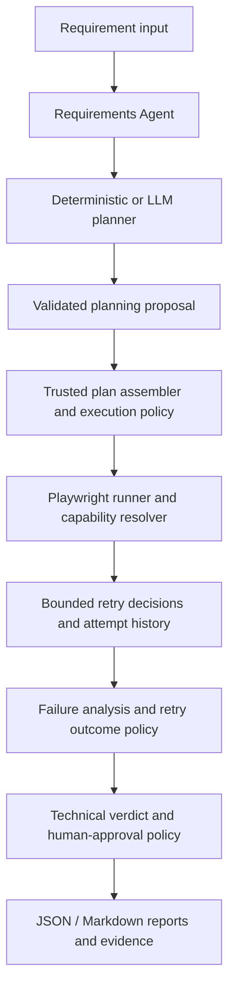

<div align="center">


<br /><br />

     

<br /><br />

<a href="README.es.md">Leer en Español</a>

</div>

# DRAGON QA Agentic Layer

> Evidence-first Quality Engineering for modern software delivery.

**AI assists QA. Evidence supports decisions. Humans retain control.**

<a id="contents"></a>
## Contents

- [Overview](#overview)
- [Current capabilities and scope](#capabilities)
- [Requirements](#requirements)
- [Installation](#installation)
- [Quick start](#quick-start)
- [How it works and architecture](#architecture)
- [Configuration reference](#configuration)
- [Adapt DRAGON QA to any project](#project-adaptation)
- [Optional LLM planning](#providers)
- [Claude Code integration](#claude-code)
- [Autonomy, execution policy, and governance](#autonomy)
- [Supported trusted checks](#trusted-checks)
- [Bounded retries and FLAKY classification](#retries)
- [Understanding results and verdicts](#verdicts)
- [Reports and evidence](#evidence)
- [Using the JavaScript / TypeScript library](#library)
- [Troubleshooting](#troubleshooting)
- [Quality checks and release verification](#quality)
- [Roadmap](#roadmap)
- [Contributing and extension guidelines](#contributing)
- [Author](#author)
- [License](#license)

---

<a id="overview"></a>
## Overview

DRAGON QA Agentic Layer is a CLI-first Quality Engineering framework that can be attached to an existing software project without replacing its application or existing test suite. It turns a requirement into a structured test plan, executes only supported trusted checks, preserves evidence and retry history, and produces an explicit technical verdict for QA review.

The goal is to make AI useful in the software delivery lifecycle without allowing a model to become an unrestricted test executor. A deterministic planner works without an LLM. An optional OpenAI-compatible planning client can propose scenarios, but the core owns scenario identifiers, timestamps, execution modes, and trusted execution intents.

The current release is **v0.1.0-alpha**. It is a working foundation, not a complete autonomous QA platform. It does not automatically implement arbitrary business flows, discover selectors, modify the application, or replace human acceptance decisions. It is intended for local development, controlled QA environments, and extension by engineering teams.

<a id="capabilities"></a>
## Current capabilities and scope

The following table distinguishes the implemented behavior from planned work. A scenario being *planned* is not evidence that it was *executed*.

| Capability | Current state |
| --- | --- |
| Requirement input | CLI requirement text is normalized and preserved; empty input is rejected. |
| Deterministic planning | Produces availability, happy-path, negative-path, and edge-case scenarios. Only the availability scenario has a trusted execution capability by default. |
| LLM planning | Optional OpenAI-compatible client, strict JSON/schema validation, and a maximum of 50 proposed scenarios. Model output is not an execution authorization. |
| Trusted checks | `application-availability`, `http-status`, `page-title`, and `page-text` are implemented. |
| Browser execution | Playwright with Chromium, Firefox, or WebKit selected through configuration. Real Chromium smoke tests have passed; this is not a claim of a complete cross-browser certification. |
| Evidence | Configurable screenshots, tracing, and video capture; JSON and Markdown reports. |
| Failure intelligence | Structured failure signals, deterministic classification, technical verdict aggregation, and a separate human-approval flag. |
| Retries | Opt-in bounded retries for network/timeout failures, per-attempt history, isolated evidence paths, conservative FLAKY classification. |
| Project configuration | YAML configuration, CLI URL override, deterministic/LLM planner selection, and a public TypeScript/JavaScript entrypoint. |
| Claude Code operation | External CLI workflow validated locally with Playwright and report inspection; no native Anthropic adapter is implied. |
| Not yet implemented | General browser-action agents, self-healing selectors, application-specific business-flow automation, full API/contract/accessibility/visual testing, a dashboard, and ready-to-use Jira/GitHub/MCP integrations. |

The configuration schema already contains flags for API, accessibility, and visual testing. Those flags do **not** mean the corresponding general-purpose runners exist. Likewise, a model may propose those scenario kinds, but unsupported scenarios remain for manual review. The repository's adapter and API-runner directories explicitly describe future work.

<a id="requirements"></a>
## Requirements

You need Node.js **20 or newer**, npm, and a browser runtime supported by Playwright. The package declares `node >=20` and the current version is `0.1.0-alpha`. The verified local consumer smoke used Windows and Node.js 24; other supported environments should be checked in your own pipeline.

For the default browser:

```bash
npx playwright install chromium
```

Install Firefox or WebKit with the same Playwright command if you select them in the YAML. On Linux or CI, additional operating-system browser dependencies may be required; follow the official Playwright installation guidance. An LLM service is **not required** for deterministic planning.

<a id="installation"></a>
## Installation

### Option A — From the repository (recommended for this alpha)

Clone the repository, install the locked dependencies, build, and run its tests:

```bash
git clone https://github.com/GFGaldeano/dragon-qa-agentic-layer.git
cd dragon-qa-agentic-layer
npm ci
npx playwright install chromium
npm run typecheck
npm test
npm run build
```

The repository CLI is invoked through `npm run dragon -- ...`. The package also includes `npm run dev`, `npm run qa:init`, and `npm run qa:run` for source-level work.

### Option B — Install a locally built tarball into another project

This is the verified package-consumer workflow. From the DRAGON QA repository, run:

```bash
npm pack
```

The command executes `prepack` (`clean` followed by `build`) and creates `dragon-qa-agentic-layer-0.1.0-alpha.tgz`. In the target project's root, install that tarball using its actual path:

```bash
npm install --save-dev /path/to/dragon-qa-agentic-layer-0.1.0-alpha.tgz
npx playwright install chromium
npx dragon-qa --version
npx dragon-qa init
```

On Windows, use the actual drive/path to the tarball. You may also run the installed CLI through `npm exec -- dragon-qa ...` or `node_modules/.bin/dragon-qa` (the `.cmd` shim on Windows).

**Distribution status:** the current evidence verifies a locally built and externally installed tarball. This README does not claim that the package has been published to the npm registry. Do not assume `npm install dragon-qa-agentic-layer` will resolve a published release until a registry release is explicitly confirmed.

For a source checkout, use `npm run dragon -- init` instead of the installed-package command.

<a id="quick-start"></a>
## Quick start

Run these commands **in the project you want to test**. Start that application's development or QA server separately.

```bash
# Installed package:
npx dragon-qa init

# Source checkout alternative:
# npm run dragon -- init
```

`init` creates `dragon-qa.config.yaml` if it does not already exist and creates `.dragon-qa/runs`. It copies the bundled example configuration when available, and does not overwrite an existing configuration. Edit the generated YAML before running.

For a locally running application:

```bash
npx dragon-qa run --url http://localhost:3000 --requirement "The application must be reachable"
```

For a source checkout:

```bash
npm run dragon -- run --url http://localhost:3000 --requirement "The application must be reachable"
```

The `--url` option overrides `project.baseUrl` for that invocation. `--requirement` is mandatory. There is no implemented `--config`, `--provider`, or `--autonomy` CLI switch in this version; edit the YAML to change those settings.

### What a first run should demonstrate

With the deterministic planner, four scenarios are generated. The trusted availability scenario can execute in `assist`; the three generic business scenarios remain in `REVIEW`. A typical result is therefore a mixture of a verified availability result and review-required scenarios, rather than a claim that the entire requirement has passed.

A local package smoke may also legitimately return `REVIEW` for availability when using a `data:` URL or another target that does not meet the real browser check. Inspect the scenario messages and evidence rather than treating the process exit code as a QA verdict.

<a id="architecture"></a>
## How it works and architecture

The current implementation follows a bounded pipeline:



The responsibilities are deliberately separated:

| Component | Responsibility |
| --- | --- |
| Requirements Agent | Trims and validates requirement text; preserves it as input data. |
| Planner providers | Deterministic planning or an optional model-generated proposal. The strict LLM output contract contains only scenario descriptions, kinds, priorities, and expected results. |
| Plan assembler | Assigns trusted IDs and timestamps, validates the final plan, and constructs execution intents through the trusted policy. |
| Execution policy | Allows only known capabilities with valid trusted parameters. Unsupported or incomplete proposals become `manual-review`. |
| Runner and executors | Dispatches a supported intent to a dedicated Playwright executor. A missing intent or executor does not trigger a guessed action. |
| Retry layer | Decides whether a confirmed failure is eligible for another attempt; records attempt results and decisions. |
| Outcome/verdict layer | Resolves conservative FLAKY outcomes, aggregates technical verdicts, and computes the independent approval requirement. |
| Reporter | Writes the run's structured JSON and human-readable Markdown, including retry histories. |

### The trust boundary

The LLM's validated output schema does not contain scenario IDs, timestamps, execution modes, execution capabilities, or execution specifications. Those are assigned by trusted code. The current LLM path therefore generates plans for review; it does not grant itself browser actions or arbitrary selectors. A supported internal capability must be explicitly supplied by a trusted code path before it can execute.

This is an architectural boundary, not a claim of a complete security sandbox. The library accepts a caller-provided base URL, and the application being tested may have side effects. Restrict targets to environments you are authorized to test and use isolated accounts/data where appropriate.

<a id="configuration"></a>
## Configuration reference

The default file is `dragon-qa.config.yaml`, resolved from the current working directory. The loader parses YAML and validates it with Zod. Start from the generated example and change only the values you need.

```yaml
project:
  name: example-project
  baseUrl: http://localhost:3000

autonomy:
  level: assist

testing:
  ui: true
  api: false
  accessibility: false
  visual: false

browser:
  engine: chromium
  headless: true
  timeoutMs: 30000

evidence:
  screenshots: true
  trace: true
  video: false

reporting:
  markdown: true
  json: true

providers:
  planner: deterministic
  failureAnalyzer: deterministic
```

### Configuration fields

| Field | Meaning / default |
| --- | --- |
| `project.name` | Required non-empty project label. |
| `project.baseUrl` | Required URL used as the trusted navigation target. The CLI `--url` override applies after loading the YAML. |
| `autonomy.level` | `observe`, `assist`, `execute`, or `autonomous`; default `assist`. |
| `testing.ui` | Boolean, default `true`. General API/accessibility/visual runners are not implied by these flags. |
| `testing.api` / `accessibility` / `visual` | Boolean, default `false`; reserved for broader testing support. |
| `browser.engine` | `chromium`, `firefox`, or `webkit`; default `chromium`. |
| `browser.headless` | Boolean, default `true`. |
| `browser.timeoutMs` | Positive number; default `30000`. |
| `evidence.screenshots` / `trace` | Boolean; both default `true`. |
| `evidence.video` | Boolean; default `false`. |
| `reporting.markdown` / `json` | Boolean; both default `true`. |
| `providers.planner` | `deterministic` (default) or `llm` through the available resolver. |
| `providers.failureAnalyzer` | Keep `deterministic`; the current orchestrator constructs the built-in analyzer. |
| `providers.plannerModel` | Optional model configuration, required when the planner is `llm`. |
| `retry` | Optional bounded retry policy; omitted or disabled means no retries. |

The schema accepts a URL string for `baseUrl`; it is not a comprehensive URL allowlist or SSRF protection layer. Do not pass untrusted destinations to a privileged execution environment. Keep project-specific configuration outside the DRAGON QA source tree, and never commit real credentials.

<a id="project-adaptation"></a>
## Adapt DRAGON QA to any project

The project-independent part is the QA pipeline. Adaptation means supplying the target application, its requirements, and the appropriate trusted checks—not copying business-specific assumptions into the core.

### Example: a separate web application

Suppose your application is called `customer-portal` and runs at `http://localhost:4200`. In that application's root:

1. Install DRAGON QA from the locally built tarball or use the source checkout.
2. Install the required Playwright browser and run `init`.
3. Set `project.name` to `customer-portal` and `project.baseUrl` to `http://localhost:4200`.
4. Leave `autonomy.level: assist`, `providers.planner: deterministic`, and retries disabled for the first run.
5. Start the application and execute a specific requirement.
6. Open the generated report; review the business scenarios and their missing acceptance details.
7. Add trusted project-specific capabilities through the extension interfaces if you need more automation.

For example:

```bash
npx dragon-qa run --requirement "The customer portal must be reachable"
```

A requirement such as “A customer can update their address” can be used for planning, but this alpha does not know the application's fields, authentication, validation rules, or update workflow. Those scenarios remain manual-review unless your integration supplies supported, trusted execution behavior. Do not turn a vague requirement into an invented automated PASS.

### Extending the execution layer

The public library exports `ScenarioExecutor`, `ScenarioExecutorResolver`, `PlaywrightRunner`, and related contracts. A custom executor receives a `TestScenario` and a context containing `runDirectory` and `baseUrl`, then returns a `TestExecutionResult`. The runner accepts an optional executor resolver.

A safe extension should define a narrow intent, validate its parameters, register a dedicated executor, and arrange for a trusted planning path to authorize that intent. The existing execution-intent union and policy are deliberately closed; adding a **new** capability requires code and contract changes, plus tests. Merely adding a YAML key, returning a new LLM JSON field, or registering an executor is not enough.

The current orchestrator constructs its default runner internally. It does not expose a complete plugin-loading mechanism for arbitrary project executors. An application embedding the library can compose the exported runner and resolver; a fully integrated new capability needs the corresponding trusted policy/contract integration. Keep enterprise-specific adapters outside the reusable core.

### Before declaring a project ready

Verify the actual target environment, acceptance criteria, credentials and permissions, data isolation, expected results, and required human review. DRAGON QA complements existing unit, integration, E2E, and manual QA processes; it does not replace them.

<a id="providers"></a>
## Optional LLM planning

The deterministic planner is the default and requires no model credentials. To use the implemented LLM planner, configure a service exposing a compatible chat-completions endpoint.

```yaml
providers:
  planner: llm
  failureAnalyzer: deterministic
  plannerModel:
    type: openai-compatible
    baseUrl: http://localhost:11434/v1
    model: your-installed-model
    # Optional for endpoints that require authentication:
    # apiKeyEnv: DRAGON_QA_API_KEY
```

Replace the endpoint and model with values for your actual provider. The client appends `/chat/completions` to `baseUrl`, sends a `POST` with the selected model and prompt, and expects a response containing `choices[0].message.content`.

If `apiKeyEnv` is configured, the named environment variable must contain a non-empty value. For example, set `DRAGON_QA_API_KEY` in your shell or secret manager before running; do not put the credential in the YAML. No API key is sent when that option is absent.

The model must return valid JSON matching the strict planning schema. The implemented model contract allows 1–50 scenarios with `title`, `description`, `kind`, `priority`, and `expectedResult`. It does not accept model-selected execution authority. Invalid JSON, schema errors, missing model configuration, missing configured credentials, and unsupported providers produce errors rather than silently inventing a plan.

**Compatibility is not universal provider support.** A compatible endpoint and its model must be tested. Native Anthropic/Claude adapters, MCP planning integration, and additional providers remain future work. The `.env.example` file lists possible integration credentials, but it is not automatically loaded by the current CLI and does not prove those integrations are implemented.

<a id="claude-code"></a>
## Claude Code integration

DRAGON QA can be operated from Claude Code as an external CLI tool. Claude Code can invoke the application, inspect its JSON/Markdown reports, and assist QA in interpreting the results. This does not require Claude Code to be configured as DRAGON's internal LLM planning provider.

A local integration smoke was completed with Claude Code 2.1.72, Node.js 24.15.0, DRAGON QA 0.1.0-alpha, and Playwright Chromium. The test used a temporary HTTP application, deterministic planning, `assist` autonomy, and disabled retries.

The run generated four scenarios: S001 executed and passed; S002–S004 remained in manual review. The final verdict was `REVIEW`, with `humanApprovalRequired: true`. Screenshot, trace, JSON, and Markdown evidence were verified.

This validates the basic workflow **Claude Code → DRAGON QA CLI → Playwright → reports → QA review**. It does not establish native Anthropic API integration, unrestricted browser autonomy, or readiness for every enterprise environment.

The existing OpenAI-compatible planning client remains available separately. It requires a compatible chat-completions endpoint and a model that satisfies DRAGON's strict planning contract. Compatibility with a particular provider/model must be verified; the Claude Code smoke did not test the official OpenAI API.

<a id="autonomy"></a>
## Autonomy, execution policy, and governance

The four configuration values are implemented, but their names must be interpreted according to the actual policy:

| Level | Current behavior |
| --- | --- |
| `observe` | All scenarios are assigned `manual-review`; no scenario execution is authorized by the policy. |
| `assist` | Supported trusted capabilities may execute. Unsupported scenarios remain for review, and human approval is required for the run. |
| `execute` | Uses the same supported-capability execution boundary; non-autonomous runs still require human approval. |
| `autonomous` | Opt-in level using the same bounded execution capabilities. It does not permit arbitrary model actions. Approval is determined by the actual results and retry-outcome policy. |

The current `execute` implementation does not include a separate persisted approval database or a workflow that verifies a previously approved plan. The `autonomous` level is available in code, but it is not a general autonomous browser agent.

A technical verdict and `humanApprovalRequired` are distinct. In autonomous mode, ordinary non-review results may not request extra approval, but empty/review results do, and a confirmed flaky recovery requires approval. The CLI prints the requirement; it does not provide a complete approval UI, audit-signoff workflow, or release-gate authorization system.

Use the default `assist` mode for initial adoption. Do not equate a missing approval request with business acceptance or permission to deploy.

<a id="trusted-checks"></a>
## Supported trusted checks

The built-in execution intents are intentionally small:

| Intent | What it checks |
| --- | --- |
| `application-availability` | Navigates to the configured base URL and verifies that browser navigation completes. It is not a complete business-health or HTTP-status assertion. |
| `http-status` | Navigates to the configured URL and compares the actual HTTP response status with a trusted integer `expectedStatus` between 100 and 599. |
| `page-title` | Navigates to the configured URL and compares the page title exactly, case-sensitively, with trusted `expectedTitle`. |
| `page-text` | Reads `body.innerText()` and checks that it contains trusted `expectedText`, case-sensitively. |

The last three checks need their corresponding trusted execution specifications. Their presence in the internal contract does not create a user-facing CLI switch for arbitrary assertions. The deterministic CLI plan currently supplies only the availability capability; the other checks are available through trusted code integrations and their executor contracts.

A title/text mismatch returns a failed result requiring review rather than automatically declaring a product bug. HTTP mismatches are classified through the failure analyzer. Network failures may be classified as environment issues. Inspect the actual evidence and requirements before deciding the root cause.

<a id="retries"></a>
## Bounded retries and FLAKY classification

Retries are **disabled by default**. Enable them explicitly in the YAML:

```yaml
retry:
  enabled: true
  maxRetries: 1
  retryableFailureTypes:
    - network
    - timeout
```

`maxRetries` counts **additional attempts**, not total attempts. A value of `1` permits at most two attempts; the hard schema maximum is `3` retries (four attempts total). Only `network` and `timeout` are allowed in the retry allowlist. An empty allowlist is valid and authorizes no failure types. Invalid or missing retry configuration does not enable retries.

The runner considers a retry only for a confirmed `failed` result with a reviewable technical verdict (`REVIEW` or `ENVIRONMENT`) and an allowed failure signal. A normal PASS, manual-review result, product-bug verdict, or test-issue verdict is not retried. The decision engine is deterministic and does not ask an LLM to decide whether to retry. There is no implemented exponential backoff, configurable retry delay, or automatic selector repair.

Each attempt is recorded with its result and, where applicable, a retry decision. When retries are enabled, evidence is isolated under `attempts/attempt-N/<scenario-id>/`. Disabled retries retain the original run-directory layout.

### When is a result FLAKY?

The outcome policy can classify a recovery as `FLAKY` only when the history contains authorized, reviewable failed attempts followed by a genuine `passed`/`PASS` result. It does not accept a raw executor-supplied `FLAKY` as proof. Contradictory or suspicious histories require review, and stronger technical verdicts are preserved rather than silently replaced by PASS.

`FLAKY` means **a successful recovery after a qualifying failure**, not proof that the application is stable or that the root cause is known. A confirmed flaky recovery requires human approval, including in autonomous mode.

<a id="verdicts"></a>
## Understanding results and verdicts

A scenario has both an execution `status` and a QA `verdict`. A run also has a final technical verdict and a separate approval flag.

| Verdict | How to interpret it |
| --- | --- |
| `PASS` | The implemented check met its expected condition. It does not prove every business requirement or every scenario passed. |
| `PRODUCT_BUG` | A product-defect classification from the available failure intelligence; requires evidence and QA judgment. |
| `TEST_ISSUE` | A test/selector-related classification; investigate the test before blaming the product. |
| `ENVIRONMENT` | An environment/network-related classification; investigate connectivity and runtime conditions. |
| `FLAKY` | A qualifying failed-then-passed recovery established from retry history; human review required. |
| `REVIEW` | Insufficient, unsupported, ambiguous, or manually reviewable execution; not a PASS. |

The aggregation priority is:

```text
PRODUCT_BUG > ENVIRONMENT > TEST_ISSUE > FLAKY > REVIEW > PASS
```

An empty result set resolves to `REVIEW`. This priority is a deterministic reporting policy, not a severity score or a substitute for a QA defect-triage process.

### Exit codes are not release gates

The current CLI sets a non-zero process exit code for execution exceptions. It does **not** implement a general policy that maps every non-PASS technical verdict to a failing process exit code. A command that exits successfully can still produce `REVIEW` and require human approval. CI users must inspect `report.json` and implement their own explicit acceptance policy rather than treating exit code 0 as a release approval.

<a id="evidence"></a>
## Reports and evidence

Every run receives a timestamp-based ID with a random suffix. The default evidence root is `.dragon-qa/runs` relative to the working directory. JSON and Markdown output can be enabled independently.

A normal run has this shape:

```text
.dragon-qa/
  runs/
    <run-id>/
      report.json
      report.md
      S001/
        page.png
        trace.zip
```

When retries are enabled, attempt-specific evidence is stored separately:

```text
.dragon-qa/
  runs/
    <run-id>/
      report.json
      report.md
      attempts/
        attempt-1/
          S001/
            page.png
            trace.zip
        attempt-2/
          S001/
            page.png
            trace.zip
```

The exact files depend on the enabled evidence options and the execution path. A failed navigation may have no screenshot or trace; a manual-review scenario normally has no browser evidence. Video is optional and is recorded through Playwright's browser-context video support. Do not assume every configured artifact exists after every failure.

### JSON structure

The report contains the run ID and timestamps, base URL, normalized requirement, plan, results, optional `retryHistories`, final verdict, and `humanApprovalRequired`. Each history contains a scenario ID, retries used, and attempt records with results and optional decisions. Evidence references contain a type and file path.

```json
{
  "runId": "<generated-run-id>",
  "baseUrl": "http://localhost:3000",
  "results": [],
  "retryHistories": [],
  "finalVerdict": "REVIEW",
  "humanApprovalRequired": true
}
```

This is an **illustrative excerpt**, not a complete report schema or a claim that an actual run had zero results. The generated report also includes the requirement, plan, and timestamps.

The Markdown report explains the requirement, final verdict, scenario results, evidence references, retry history, and human-validation status. Evidence files should be treated as potentially sensitive: screenshots, traces, and videos may contain application data. Avoid committing `.dragon-qa/runs` or publishing artifacts without review.

<a id="library"></a>
## Using the JavaScript / TypeScript library

The package exposes `dist/index.js` as its JavaScript entrypoint and `dist/index.d.ts` as its TypeScript declaration entrypoint. The external consumer smoke verified both entries.

A minimal programmatic example uses the exported configuration loader and orchestrator:

```ts
import {
  loadDragonConfig,
  DragonOrchestrator
} from "dragon-qa-agentic-layer";

async function main(): Promise<void> {
  const config = loadDragonConfig("dragon-qa.config.yaml");
  const orchestrator = new DragonOrchestrator(config);

  const { result, runDirectory } = await orchestrator.run(
    "The application must be reachable"
  );

  console.log(result.finalVerdict);
  console.log(result.humanApprovalRequired);
  console.log(runDirectory);
}

main().catch(error => {
  console.error(error);
  process.exitCode = 1;
});
```

This example uses the deterministic planner. A programmatic LLM integration must provide the appropriate planner model client through the orchestrator dependencies; the CLI performs that resolution automatically from YAML/environment configuration.

The public entrypoint includes the core contracts, configuration, orchestrator, planning providers, runner/resolver interfaces, evidence manager, and reporter. It does not currently export every internal retry implementation. Avoid relying on undocumented deep imports as a stable public API.

<a id="troubleshooting"></a>
## Troubleshooting

| Symptom | What to check |
| --- | --- |
| `DRAGON QA configuration not found` | Run `init` in the intended project directory, or execute the CLI from the directory containing `dragon-qa.config.yaml`. |
| YAML/Zod validation error | Check required project fields, URL syntax, autonomy/engine values, positive timeout, and retry policy. Start from the bundled example. |
| Browser executable missing | Run `npx playwright install chromium` (or the selected browser) using the project's Playwright installation. |
| Connection refused / environment verdict | Start the target application, verify the URL/port and network access, and inspect the scenario failure message. |
| All scenarios are REVIEW | Check the selected autonomy level, trusted capabilities, unsupported scenario kinds, and report messages. A valid plan is not necessarily executable. |
| LLM configuration is required | Set `providers.plannerModel` when using `providers.planner: llm`, or return to `deterministic`. |
| LLM API key environment variable required | Set the exact environment variable named by `apiKeyEnv`; the CLI does not automatically load `.env`. |
| Invalid JSON / model schema failure | Check that the endpoint supports chat completions and the model returns the required strict JSON shape. |
| Unexpected retry behavior | Inspect `retry.enabled`, `maxRetries`, allowlist, and the recorded retry decision. Only qualifying failed results are retried. |
| Missing screenshot or trace | Check evidence settings and whether navigation or capture reached the relevant step. Some failures and manual-review results have no browser artifacts. |
| Command exited 0 but the run says REVIEW | Expected possibility: inspect `report.json`; the CLI exit code is not a complete QA release gate. |

For a reproducible report, capture the DRAGON QA version, Node/npm versions, relevant sanitized YAML, command, error message, and the relevant JSON/Markdown report. Remove credentials and sensitive application data before sharing logs or traces.

<a id="quality"></a>
## Quality checks and release verification

For source-level changes, use the repository's existing gates:

```bash
npm run typecheck
npm test
npm run build
git diff --check
```

The latest user-verified local run for the supplied source revision `3a993268f31e` reported **35 test suites and 233 tests passing**, including the real Chromium retry smoke. A separately installed local tarball also passed JavaScript/TypeScript entrypoint checks, CLI initialization, execution, and report verification. These are recorded local results, not a live CI badge or a guarantee that every environment has been tested.

The release-readiness changes were merged into `main` through PR #20 (`352a6fc`). The Claude Code integration smoke described above was subsequently completed against that revision. These are recorded local results, not a live CI badge or a guarantee that every environment has been tested. No npm registry publication has been verified. This documentation update adds no runtime dependencies or execution-code changes.

<a id="roadmap"></a>
## Roadmap

The next development areas are intentionally separate from the implemented alpha:

| Area | Direction |
| --- | --- |
| Broader execution | More trusted, project-specific capabilities and reusable test adapters. |
| API and contracts | OpenAPI discovery, REST execution, schema/contract validation, negative and authentication scenarios. |
| Accessibility and visual QA | Dedicated checks with explicit evidence and review policies. |
| Integrations | Jira, GitHub, MCP, additional model providers, and CI/CD workflows. |
| Operational experience | Improved configuration, diagnostics, reporting, approval workflows, and eventually a dashboard where justified. |
| Reliability | Further retry observability and carefully reviewed recovery strategies; no unrestricted self-healing is promised. |

These are directions, not shipped features or committed delivery dates. Any new execution capability should preserve the trusted-intent boundary and be accompanied by tests, evidence, and documentation.

<a id="contributing"></a>
## Contributing and extension guidelines

Contributions are welcome through the repository's GitHub issues and pull requests. Before making a substantial change, describe the problem, the proposed behavior, and how it fits the existing contracts.

For implementation work, prefer a focused branch and a small, reviewable change. Add or update tests for new behavior, run the typecheck/test/build gates, and document new configuration or public API changes. Keep provider-specific and enterprise-specific integration code separate from the core where possible.

Do not let a model-generated proposal assign trusted execution authority. New capabilities need explicit validation, a dedicated executor, and a policy decision. Preserve the distinction between technical verdict and human approval, and do not turn a retry into a silent PASS.

The repository includes benchmark inspiration notes. DRAGON QA's core is independently implemented; any future inclusion of third-party source code requires a license and compatibility review. Do not copy source from another project into the core without that review.

For questions or contributions, use the repository's <a href="https://github.com/GFGaldeano/dragon-qa-agentic-layer/issues">Issues</a> and <a href="https://github.com/GFGaldeano/dragon-qa-agentic-layer/pulls">Pull requests</a>.

<a id="author"></a>
## Author

**Gustavo Federico Galdeano** — Dragon Pyramid.

DRAGON QA Agentic Layer is an independently implemented Quality Engineering project. Its architecture was informed by benchmark research documented in [Benchmark Research](docs/BENCHMARK_INSPIRATION.md). That research does not imply that the referenced projects' source code is incorporated into DRAGON QA.

The project is designed to be reusable across software teams and projects rather than tied to a particular employer, customer, application, or LLM vendor.

<a id="license"></a>
## License

DRAGON QA Agentic Layer is licensed under the **MIT License**. Copyright © 2026 Gustavo Federico Galdeano.

See [LICENSE](LICENSE) for the complete license text. The MIT license permits use, modification, distribution, and commercial use subject to its conditions, including preservation of the copyright and license notice. Third-party dependencies retain their own licenses.

---

Documentation for the verified `0.1.0-alpha` source snapshot. See the roadmap for work that is not implemented.
